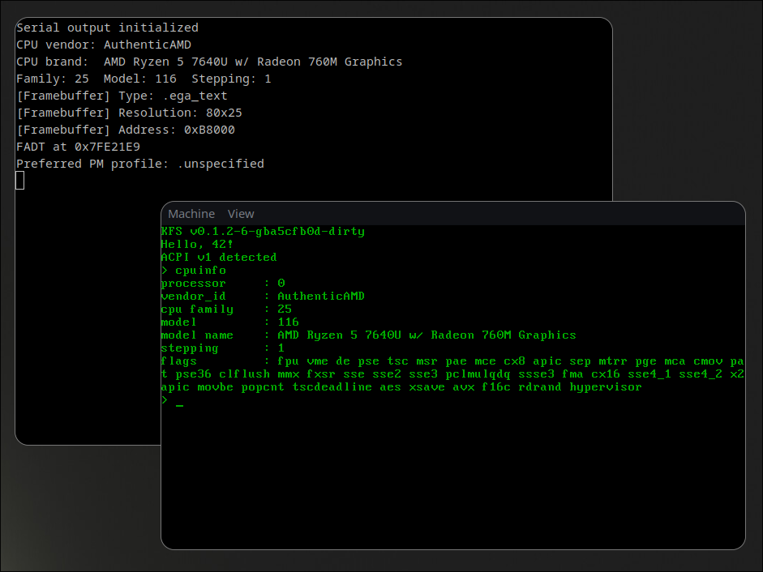

# Kaname

[](https://github.com/ms-is-coding/kaname/actions/workflows/ci.yml)

Kaname is a minimal x86 kernel written in Zig.
Built as part of the 42 KFS project, it is a project exploring kernel development fundamentals.

The name Kaname (要) stands for "essence" / "main point" in Japanese, it is meant to be easy to read and meaningful.

---

## Demo



---

## Features

### Currently implemented

- x86 bare-metal target (Multiboot2 via GRUB2 or Limine)
- GDT / IDT setup
- 8259 PIC + interrupt handling
- PS/2 keyboard driver (US QWERTY, ring buffer)
- VGA text mode (80×25)
- Framebuffer / VBE graphics
- Serial output (COM1, 38400 baud)
- CPUID feature detection
- ACPI shutdown (S5 via FADT)
- Local APIC (LAPIC) initialization
- Tiny interactive shell
- 3D "42" Phong-shaded logo

### Working on

- Virtual terminals
- VGA scrollback buffer
- Kernel stack trace

### Planned

- Memory paging & allocator
- better ACPI implementation
- ELF loader
- Process management
- SMP
- virtual filesystem
- TCP/IP stack

---

## Project Structure

```txt
arch/x86/     boot entry, GDT, IDT, PIC, LAPIC, CPUID, MSR, ports
drivers/      serial, VGA, keyboard, ACPI, VBE
kernel/       kmain, shell, 42-logo demo
abi/          shared type definitions
meta/         GRUB and Limine boot configs
scripts/      toolchain install helpers
```

---

## Acknowledgements

- [OSDev Wiki](https://wiki.osdev.org)
- Multiboot2 specification - [gnu.org](https://www.gnu.org/software/grub/manual/multiboot2/multiboot.html)
- [ACPICA](https://acpica.org)
- [Wikipedia](https://wikipedia.org)
- [QEMU project](https://qemu.org)
- [Bochs project](https://bochs.sourceforge.io)
- Specific references can be found at the top of each source file

---

## License

This project is licensed under GNU GPLv3. See [LICENSE](LICENSE) for more details.
